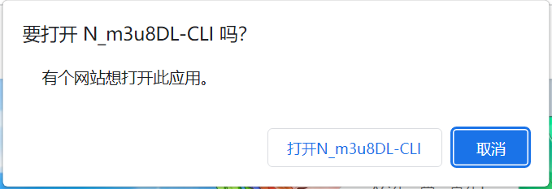
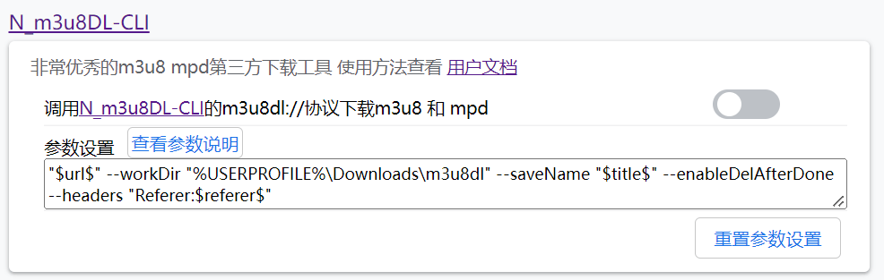
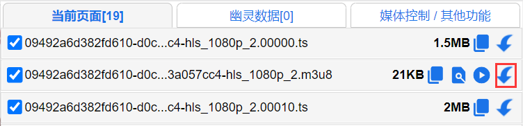
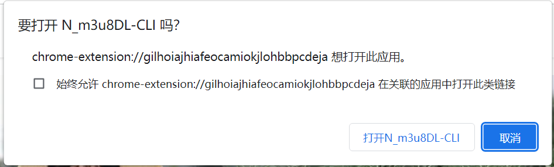

# 使用 m3u8dl:// 协议

下载N\_m3u8DL-CLI [https://github.com/nilaoda/N\_m3u8DL-CLI/releases](https://github.com/nilaoda/N\_m3u8DL-CLI/releases)

如果你电脑里没有安装ffmpeg 请下载 N\_m3u8DL-CLI\_v3.0.\*\_with\_ffmpeg\_and\_SimpleG.zip

解压后 建议 N\_m3u8DL-CLI\_v3.0.\*.exe 重命名为 m3u8dl.exe 或其他固定名称。否则每次更新版本都需要重新注册协议，以后更新N\_m3u8DL-CLI只需修改文件名替换即可。

使用cmd 运行`m3u8dl.exe --registerUrlProtocol` 注册协议


注册完协议后，不要再移动m3u8dl.exe文件的位置。你应该解压到一个固定位置再进行注册。


检查是否完成，在浏览器地址栏输入 `m3u8dl://` 回车 是否有如下对话框

<figure><figcaption></figcaption></figure>

看到此窗口，恭喜你已经完成了`m3u8dl://`协议的注册，之后在猫抓设置，开启 `调用m3u8dl://协议下载m3u8 和 mpd` 选项，你可以自定义修改调用参数，点击 `查看参数说明` 按钮查看所有参数列表。

<figure><figcaption>
开启调用协议和参数设置
</figcaption></figure>

如果猫抓嗅探到m3u8或mpd文件的存在，popup页面直接点击文件的下载按钮会直接调用N\_m3u8DL-CLI下载

<figure><figcaption></figcaption></figure>

第一次使用会弹出窗口

<figure><figcaption></figcaption></figure>

勾选 `始终允许` 下次使用不会再弹出确认窗口。

更多N\_m3u8DL-CLI使用方法，查看官方使用文档 [https://nilaoda.github.io/N\_m3u8DL-CLI/](https://nilaoda.github.io/N\_m3u8DL-CLI/)


N\_m3u8DL-CLI 已停止开发，作者已开发功能更加强大新程序 [https://github.com/nilaoda/N\_m3u8DL-RE](https://github.com/nilaoda/N\_m3u8DL-RE)

可参考 [diao-yong-ben-di-cheng-xu.md](diao-yong-ben-di-cheng-xu.md "mention")说明进行设置调用。

