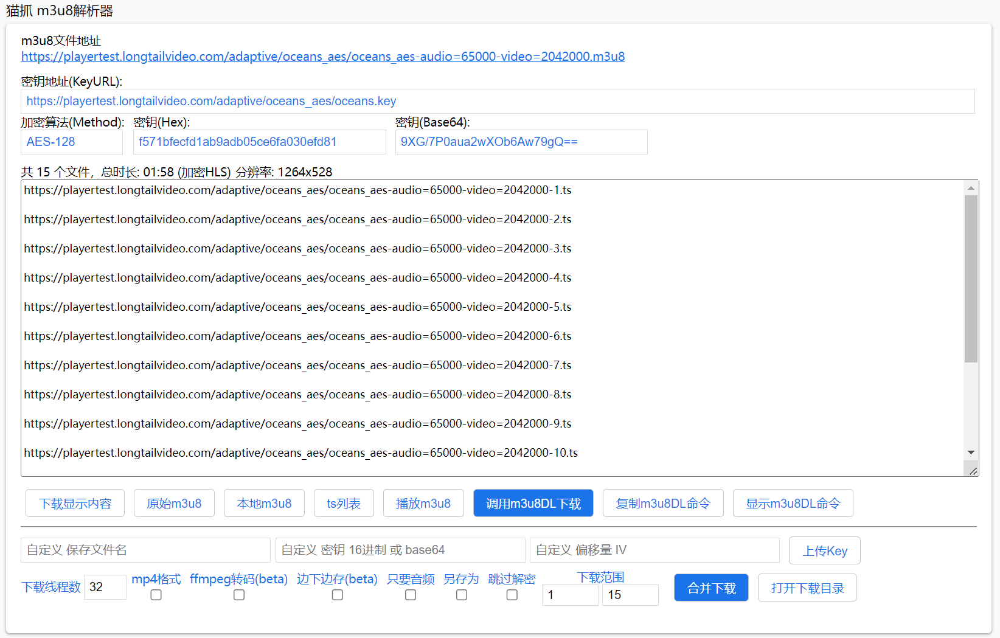
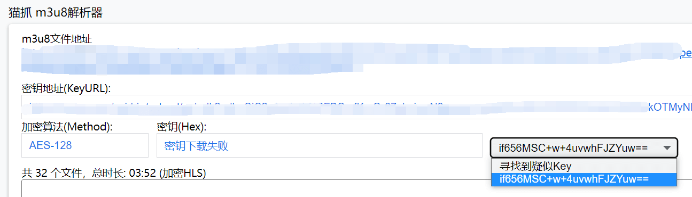

# M3U8解析合并下载

## 解析合并


m3u8合并下载 需要有足够的内存，否则可能会崩溃。建议使用 边下边存 或者 第三方下载软件 m3u8dl 协议等。


抓取到m3u8资源时旁边会多出一个解析图标，点击进入m3u8解析器。

.png>)

### **合并下载**

猫抓自带一个简易的m3u8切片合并功能，能合并下载大部分网站的m3u8资源。

### **寻找到疑似密钥** 

使用`深度搜索`脚本 或 油猴脚本，能自动收集疑似密钥的数据。如果收集到有疑似密钥的数据会出现该选项。选择一个自动填入自定义密钥输入框内。[深度搜索](popup-1.md#shen-du-sou-suo)

<figure><figcaption>
寻找到疑似Key
</figcaption></figure>


如果存在多个密钥，请逐一尝试，合并下载1个切片，尝试是否能播放，直到选择到正确的密钥，再进行完整范围合并下载。


### **下载切片列表**

使用该按钮下载所有视频切片链接到记事本txt文件内，使用本地软件批量下载并合并。

### get参数

部分网站需要给ts添加和m3u8一样的参数才能下载，点击此按钮给ts文件添加或删除m3u8文件的参数。

### **转换MP4格式**

只支持TS格式到MP4，转码过程发现无法转码会自动采用二进制合并模式，请使用第三方软件转码。


合并下载 格式转换 在内存中进行，电脑内存不足可能导致页面崩溃. **推荐优先使用 ffmpeg转码**


### ffmpeg转码

下载完毕后跳转到在线ffmpeg网站进行转码。勾选后，不能使用边下边存。


由于WebAssembly的限制，在线ffmpeg目前只能处理最大2G大小的视频。


### **自定义密钥**

部分网站的KEY不在m3u8文件内 猫抓无法解密合并，需自行寻找KEY填入或上传KEY文件。可填入 base64 、16进制以及密钥文件的url地址。


目前暂时只支持AES-128-CBC加密的资源，如遇到ChaCha20 / SAMPLE-AES-CTR 等加密方式的，请使用第三方工具。


### **跳过解密**

先强制合并下载 之后使用本地解密工具一次性解密。

### **下载范围**

选择你要下载的切片范围。如果m3u8存在#EXT-X-MAP标签，不是从 1 起始的视频可能无法播放。支持填写时间格式 00:00:00

### **只要音频**

只保存音频，利用转码器实现，需勾选`mp4转码`最后格式仍为mp4

### 另存为

合并后文件储存在浏览器设置的下载目录内，想要修改储存目录需勾选另存为，合并完成后弹出提示框，选择你要储存的目录或者更改储存文件名。

### **录制直播**

直播m3u8会显示该功能，解析器监听m3u8，持续把视频保存到内存中，直到点击`下载录制`按钮。不建议长时间录制。建议勾选边下边存，避免长时间录制导致内存占用过多页面崩溃。

### **下载线程数**

同时下载多少个切片文件，部分网站对同时文件下载数量有限制，过大会导致下载错误，需适当减少线程数。目前chrome浏览器限制最大并发数为6，大于6的线程数会进入等待状态不会工作。

### 边下边存

通过流式下载，边下边清理内存，解决下载大文件内存不够用或者浏览器限制问题。firefox暂不支持。勾选后，不能使用在线ffmpeg转码。录制直播，建议勾选该选项。

### 调用m3u8DL下载

猫抓已经支持调用 [N\_m3u8DL-CLI](https://github.com/nilaoda/N_m3u8DL-CLI) 的协议，具体查看教程[m3u8dl.md](m3u8dl.md "mention")

## 入口

通过 其他功能-M3U8解析器 进入解析器入口

### BaseURL

如果你输入的m3u8内容 切片是本地文件（不包含网址），需要输入BaseURL 获取远程切片文件。

### m3u8Url

直接输入m3u8的url地址 点击解析 进行下一步操作。

### https://bmmmd.com/${range:1-5}.ts

该输入框支持range标签，例如 `https://bmmmd.com/${range:1-3}.ts` 回车 生成\
`https://bmmmd.com/1.ts`\
`https://bmmmd.com/2.ts`\
`https://bmmmd.com/3.ts`

range标签支持第二个参数 表示强制多少位，不足的前面补0 例如 `https://bmmmd.com/${range:1-3,3}.ts` 回车 生成\
`https://bmmmd.com/001.ts`\
`https://bmmmd.com/002.ts`\
`https://bmmmd.com/003.ts`

range标签 支持结束序号未知 例如 `https://bmmmd.com/${range:1-?}.ts` 回车 从1开始尝试获取切片 直到获取404或错误。

### Referer

以上所有操作，如果出现错误，应提前输入 Referer 请求头数据，如果只输入网址，只设置 Referer

想设置其他请求头，需使用JSON格式 例如

`{"origin":"https://www.bmmmd.com","referer":"https://www.bmmmd.com/test.m3u8"}`


严格JSON格式，属性必须使用双引号。

