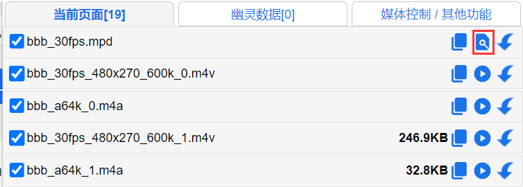
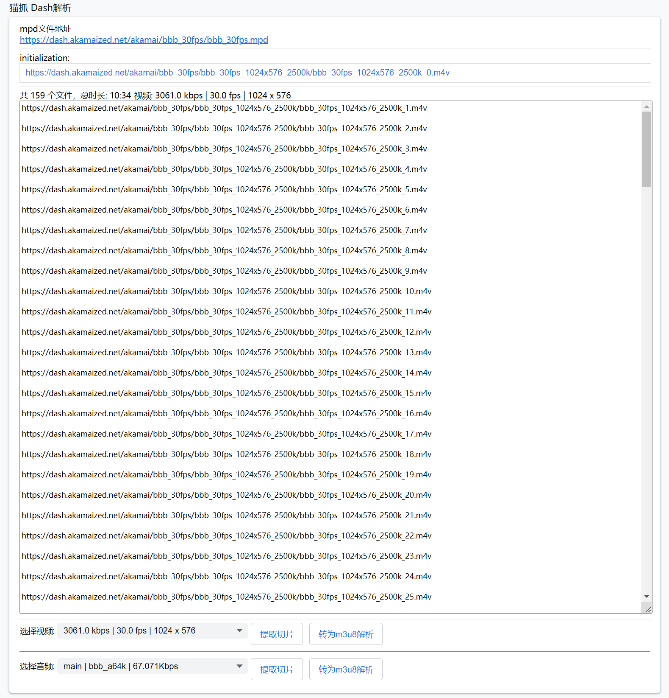

# Dash MPD解析

猫抓获取到mpd文件会在popup显示解析按钮。

<figure><figcaption>
mpd解析按钮
</figcaption></figure>

<figure><figcaption>
mpd解析器
</figcaption></figure>

解析器会提取所有音频和视频的切片，底部选择需要的视频清晰度和音频选择。

点击 `转为m3u8解析` 在m3u8解析器里 合并下载 或其他操作。

m3u8解析器操作查看教程 [m3u8parse.md](m3u8parse.md "mention")


目前Dash解析器还不支持加密和直播类型。

