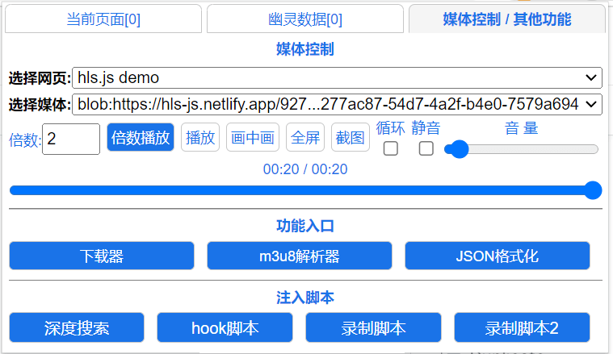
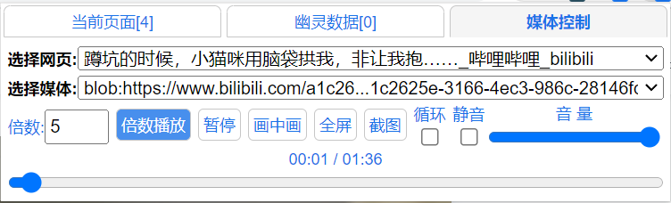

# 媒体控制

<figure><figcaption>
其他控制 选择脚本
</figcaption></figure>

## **媒体控制**

倍速范围0 - 16.0 允许小数，小于1.0会慢速播放。

<figure><figcaption>
媒体控制
</figcaption></figure>

浏览器安全限制  所有脚本 无法捕获iframe框架内的视频, 也无法操控跨域的iframe框架内的视频


Firefox 不支持画中画 全屏

