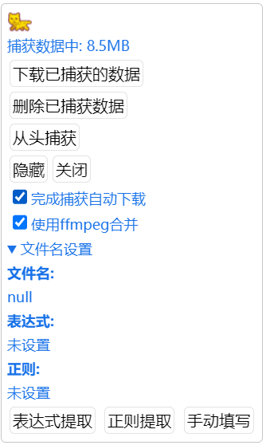
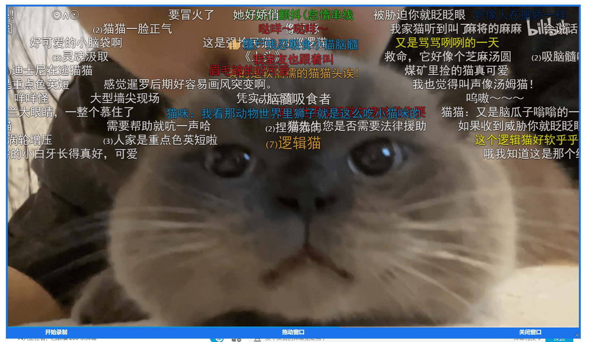
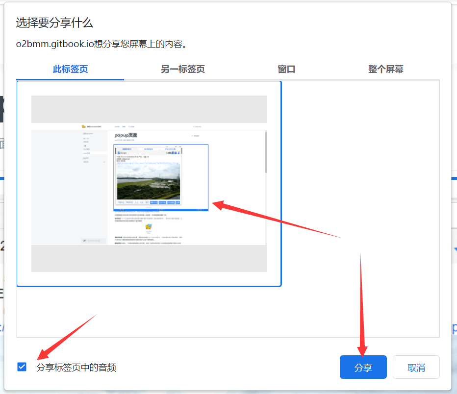

# 深度搜索 / 缓存捕捉

## **深度搜索**

如果默认情况下猫抓无法嗅探到资源，强烈建议优先尝试深度搜索。通过拦截一些重要函数分析出网站里隐藏的m3u8或mpd文件。还会尝试缓存m3u8文件内容，解决部分网站m3u8地址只能打开一次。并且收集所有疑似m3u8密钥的数据[#maybekey](m3u8parse.md#maybekey "mention")

## 捕获/录制

### **缓存捕捉**

获取视频缓存, 在深度搜索功能任然无法抓取情况下使用, 缺点是需要等待视频缓冲完整，优点是几乎支持大部分网站, 可以用倍数播放或者拖动进度条，只需缓冲完整个视频会提示捕获完毕。捕获一次只能捕获一个视频，否则数据错乱。

<figure><figcaption>
打开捕获后会在网页右上角出现捕获提示和操作按钮。
</figcaption></figure>

#### 表达式提取

通过css选择器 选择当前页面的文字 作为文件名

#### 正则提取

通过正则在当前页面获取字符作为文件名。如果未设置 表达式提取 会从整个网页正则匹配，如果已设置 表达式提取 会从表达式提取结果后再正则提取。

#### 使用ffmpeg合并

捕获的数据分为 视频 和 音频 两个文件，这是正常现象（注意浏览器提示，允许多个文件下载），可以勾选该选项，下载时如果文件小于2G会进行在线ffmpeg合并。


缓存捕捉前固定视频清晰度等设置，过程中 不能修改清晰度 否则造成捕获的数据错乱！

使用缓存捕获连续捕获视频，请等待视频播放完毕自动下载，手动下载容易造成数据混乱。



**猫抓非常不建议使用缓存捕获功能录制直播，扩展储存数据依赖内存，一旦崩溃数据将不复存在，为了你珍贵的数据，使用猫抓获取到直播地址，用第三方软件进行读取保存。**


### **视频录制**

使用JavaScript内置录制函数对视频进行录制，可以录制部分直播网站，它会录制你对视频的所有操作，包括播放、暂停、拖动、切换。录制视频需要更强的CPU，否则会很卡顿。**无法录制版权保护的视频。**

### **屏幕捕捉(beta)**

使用分享屏幕方法实现录制视频，需要chromium 104版本以上。

<figure><figcaption>
屏幕捕捉
</figcaption></figure>

选择 屏幕捕捉， 点击后页面会出现录制区域框，鼠标按住`拖动窗口`拖动到你要录制的区域，右下角可以调窗口大小。点击开始录制浏览器会让你选择分享的页面，选择当前页面并勾选分享音频(如果你同时要录制音频的话)。录制完成 最后格式为 webm...录制过程中听不到网页声音，请升级你的浏览器到最新版。

<figure><figcaption></figcaption></figure>

### 录制WebRTC

遇到缓存捕捉无效的直播大概率采用WebRTC技术，可以尝试使用本脚本。WebRTC通常用来视频直播，采用此技术的直播没有常规的视频流，所以缓存捕捉功能会失效。


Firefox 暂不支持所有捕获脚本

