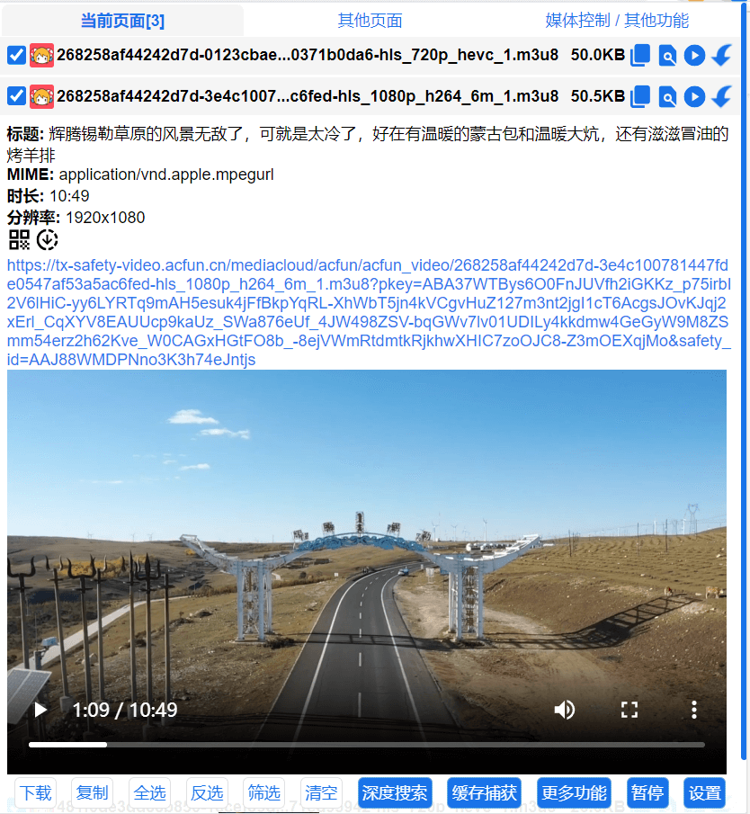

# popup页面

 如果资源包含该图标，表示资源来自深度搜索、正则表达式、油猴脚本等特殊资源。

## 当前页面

当前页面抓取的资源。

## **其他页面**

其他页面所有抓取的资源

## 合并下载

许多网站会把视频和音频分离，当你勾选两条资源(一条视频，一条音频)，会出现 合并下载 按钮，可以在线把音频和视频合并然后下载。

## **更多功能 - 模拟手机**

点击后会刷新当前页面，并修改浏览器User-Agent为手机，让网页展示出手机版页面，很多PC端无法下载和嗅探的资源再手机版页面可以被下载和嗅探。

## **更多功能 - 自动下载**

点击后，一旦嗅探到资源会立刻下载，适合一些网站找不到m3u8但是会有源源不断的ts出现，这时你可以一边播放一边下载，最后使用第三方工具合并。

## **其他按钮**

显示资源地址的二维码按钮

携带请求头 Referer下载资源
