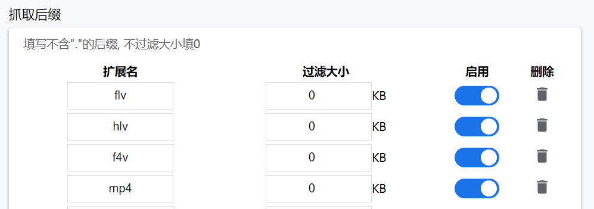
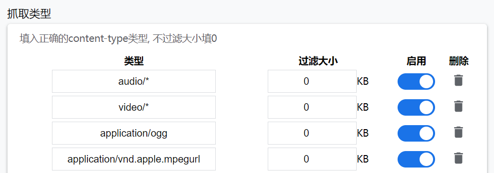
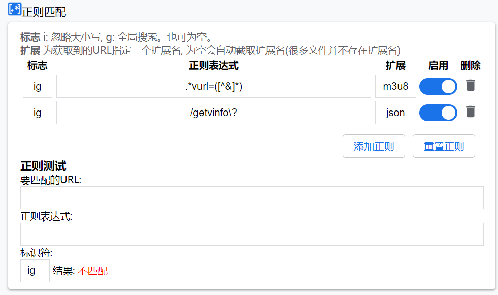
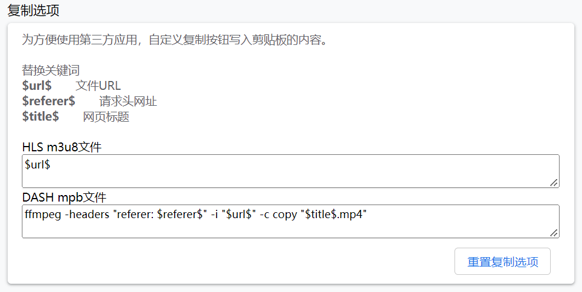
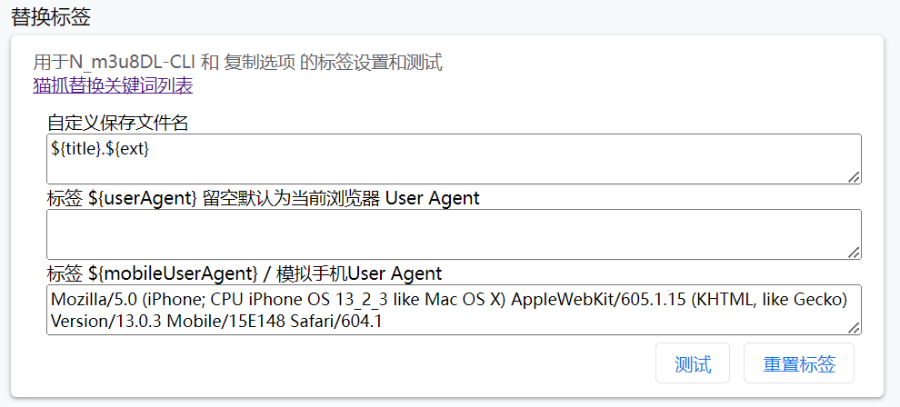
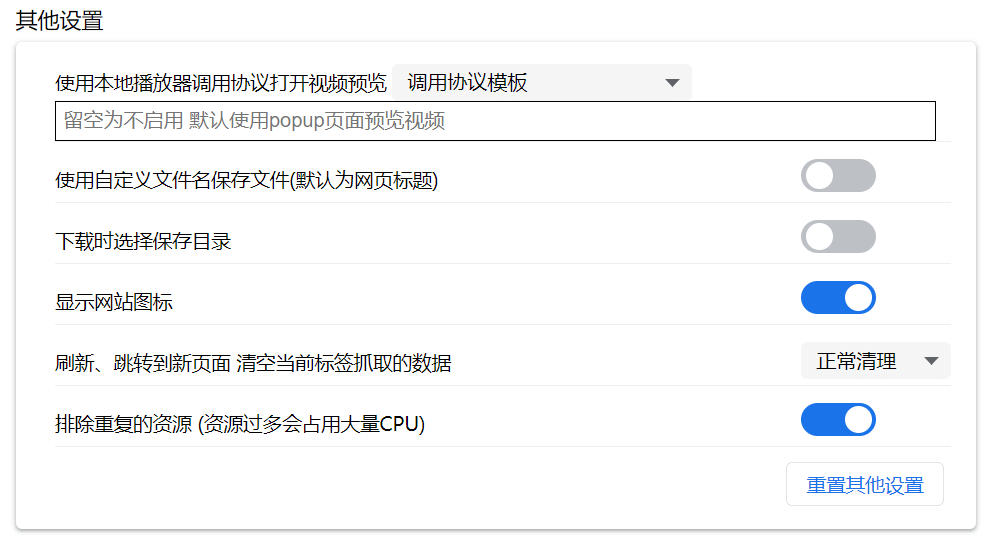

# 设置

## **扩展和类型匹配规则**

浏览器接收到文件时判断





抓取类型，也称为mime扩展类型，部分网站不提供正确的文件后缀，需使用mime扩展类型判断文件，由于历史原因默认配置有 `audio/*` 和 `video/*` 特别的类型，不代表支持通配符。


扩展名 类型 不区分大小写，储存时自动转为小写。


## **正则匹配**

浏览器准备打开这个URL之前就对这个URL进行正则匹配。所以优先级最高。



**扩展** 猫抓无法知道正则匹配的资源类型，需要指定一个扩展名，留空会尝试截取网址的后缀名，由于许多网址没有后缀所以可能最终无法知晓类型，无法在popup页面显示相应的解析器入口或播放图标。

正则匹配有两种匹配模式:

**提取url** 使用括号，可以只提取括号内的网址 (如上图第一个示例。)

**常规匹配** 判断URL是否匹配。(如上图第二个示例。)

## 屏蔽网址

在部分网址上不需要扩展，可以设置网址，支持通配符，例如 `https://x.com/*`

开启 设置为白名单 选项，列表更改为白名单，只有该名单内的网址扩展才会正常工作。

## 复制选项

方便使用第三方工具，点击popup页面复制按钮，直接复制你想要的字符串。



### URL Protocol m3u8dl

<figure><figcaption></figcaption></figure>

具体查看[m3u8dl.md](m3u8dl.md "mention")

## 替换标签

<figure><figcaption></figcaption></figure>

### 自定义保存文件名

需打开 **其他设置** 里 `使用自定义文件名保存文件` 选项。可以创建目录 例`${title}/${fullFileName}` 最后储存在 以 title 创建的文件夹内。


## 标签系统 / 替换关键词(2.3.1+) <a href="#keywords" id="keywords"></a>

用于 复制 、数据发送、URL Protocol m3u8dl、调用程序、替换标签 等 使用的关键词替换。标签区分大小写。

详细查看 [tag.md](tag.md "mention")

## 其他设置



### 始终不启用猫抓下载器

下载文件时，检测到资源服务器拒绝下载会重新打开猫抓下载器携带referer参数重新下载文件。如果你使用第三方下载软件打开该选项禁止猫抓下载器被调用。

### 使用本地播放器调用协议打开视频预览 <a href="#player-protocol" id="player-protocol"></a>

部分本地播放器有调用协议，如PotPlayer 有 `potplayer://` 猫抓就能使用该协议直接调用potplayer去播放抓取的资源。

支持替换标签

右侧 `调用协议模板` 下拉菜单有常用的播放器协议。只有部分安卓浏览器支持`intent:`协议调用，所以手机用户更建议使用 `系统分享` 模式。

不使用调用协议 删除清空即可。


系统分享模式对浏览器版本有需求。

具体查看[https://caniuse.com/mdn-api\_navigator\_share](https://caniuse.com/mdn-api_navigator_share)


### **m3u8dl://协议调用**

具体查看教程[m3u8dl.md](m3u8dl.md "mention")

### 刷新、跳转到新页面 清空当前标签抓取的数据

分为 不清空 正常清理 频繁清理。

其中 频繁清理 比较敏感，比如视频网站，点击观看下一个视频时会先清空。

正常清理 严格按照 是否用户主动刷新，主动点击新链接到新页面，以上动作才会触发清空。

频繁清理可能会导致部分网站在嗅探到资源后立刻被清理，遇到嗅探不到资源的网站，请先尝试清理模式改为 正常 或者 不清理。

## 发送数据 <a href="#send" id="send"></a>

能够自定义发送数据到第三方地址上，请求体 确保为JOSN格式

`${action}`为特殊标签, 表示不同数据类型, 如果是捕获数据替换为 `catch` 字符串, 如果是密钥数据 会被替换为 `addKey` 字符串。

如果`${action}` 是`catch` ${data} 则为 文件对象转为JSON格式内容

如果`${action}` 是`addKey` ${data} 则为 密钥base64字符串

示例: `{"action": "${action}", "data": ${data}, "tabId": "${tabId}"}`

```json
// {"action": "${action}", "data": ${data}, "tabId": "${tabId}"}
{
    action: "catch",
    data: {
        name: "文件名",
        url: "资源地址",
        size: "资源大小"
        requestHeaders: {
            referer: "也可能不存在",
            origin: "也可能不存在",
            cookie: "也可能不存在"
        }
        ...: "其他"
    },
    tabId: "数据来源的tab ID"
}

// JSON 接受到疑似密钥
{
    action: "addKey",
    data: "base64数据",
    tabId: "数据来源的tab ID"
}
```


数据发送功能测试中，不同版本JSON结构会有差异。

